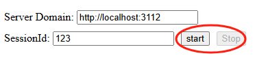
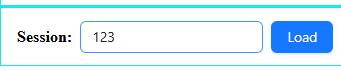
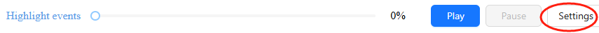
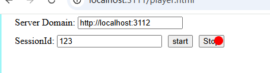

# User Behavior Monitoring

This tool "records" users' behavior and store data as json files.
Later, the "player" can simply load json data and can replay what happened.

It is similar to [rrweb](https://www.rrweb.io/) and [hotjar](https://www.hotjar.com/)

It might not be that omnipotent but still allows you to track user's real behavior in a very granular way, compared to normal Tracking libraries which only send aggregated user behaviors as trackign events.

This Repo is composed of 4 parts:
- The Typescript lib itself, which is in the `frontend/core` folder,
- A recorder in `frontend/ui/recorder`, which is a simple UI showcasing how to record.
- A naive API server in `server` which receives the data sent from the recorder, if you build your server logic, be sure to reference this file.
- A player in `frontend/ui/player`, which is a simple UI showcasing how to play users' real bahvior.

Note that the `recorder`,`naive api` and `player` components in this repo are just for demo/reference during development, you need to check the [How it works](#hiw) below to see how you should send data back to your own server.

# Demo
Be sure to check out the demo, the page is recorded first and then played just like a "video".

https://github.com/user-attachments/assets/da84c78d-3011-4c25-bdd6-f968f1106560


# How to test it out in localhost?
- Install dependencies `yarn` 
- Open two terminals, `yarn dev` which opens up two UIs, the recorder and the player
- Spin up a local server `yarn server`
- Go to the `recorder` page and click the `start` button and then play with the UI, click `stop` once you are done

- Go the the `player` page and input the id(default value 123), and `load` it.

- Finally click `play`, and voila you see the magic 
- Note that you can drag the progress bar and can set play speed via the settings button


# How it works {#hiw}
```
# example for how to record
 const sessionId = <your_unique_session_id:number>;
 recorder.init({
    // once 10 records are accumulated, data get flushed via onRecordItemsEmitted
    bufferSize: 10,
    // how many runs the onRecordItemsEmitted gets called
    // for example = 10 = 3+3+3+1, 4 runs
    maxEmitSize: 3,
    // called when snapshot is taken on page load
    onRootEmitted: async (root, metaInfo) => {
        // write to your own server
        await fetch(domain + '/ubm', {
            method: 'post',
            headers: {
                'content-type': 'application/json',
            },
            body: JSON.stringify({
                // the current url
                location: location.href,
                sessionId,
                root,
                metaInfo,
            }),
        });
    },
    // called in a streaming way
    // note that not only the events during the normal user
    // interactions but also the final stop event are all
    // sent via this callback
    onRecordItemsEmitted: async (items: RecordItem[]) => {
        await fetch(domain + '/ubm/records', {
            method: 'post',
            headers: {
                'content-type': 'application/json',
            },
            body: JSON.stringify({
                sessionId,
                records: items,
            }),
        });
    },
    // you are suggested to send a stop signal to your remote server
    onStopped: async () => {
        await fetch(domain + '/ubm/stop', {
            method: 'post',
            headers: {
                'content-type': 'application/json',
            },
            body: JSON.stringify({
                sessionId,
            })
        });
    },
    debugMode: false,
        });
recorder.record();

// Once you determine you are done with the page, call this
// this will make sure all buffered data get flushed
// and all states are stored back to its original state,
// which allows a new record session to be triggered.
recorder.stop();


# How to play
UI wise just use the player we provide for now, and provide the url of your server.

But still you need to implement your own server by referencing `server/ubm-sample-server.ts` to implement the data capture and data fetch(see `router.get('/:sessionId')`)

```


1. Take a global snapshot of the page by recursively walk all the Dom Nodes and all nodes are transformed into a nested JSON tree.
2. The `onRootEmitted` is triggered with the nested json data, you may listen to this event and send this data to your remote server to store.
2. Register a MutationObserver for Dom changes, and register scroll/mousemove/click handlers for users' interaction
3. When any event is triggered by the user, the event is stashed locally
4. When there are `bufferSize` events or the recorder is stopped, the stashed data will be emitted via `onRecordItemsEmitted`, note that at max `maxEmitSize` will be emitted. For example, if `bufferSize` is 200 and `maxEmitSie` is 60, then the onRecordItemsEmitted will be triggered 4 times, 60,60,60 and 20 for each run. 
You may listen to this event and send the emitted data to your remote server.

# Future opportunities
1. Password input should be pixelated or replaced with xxxxx, this is easily achivable by storing the value as xxxxx
2. This tool has been tested on some very complex pages. For example, I used to be a main contributor to the [Tiktok Creative Center](https://ads.tiktok.com/business/creativecenter/pc/en) site, and this tool can record all the complex UIs for this site.
3. The logic still occupies a lot of CPU usage for handling normal users' eventloop, moving on I consider either offloading some computations to a WebWorker or break things down and queue it using requestIdleCallback, which is inspired by `React fiber` and its new interruptible `startTransition` API.
4. I need to add more details as to how to build your own server
